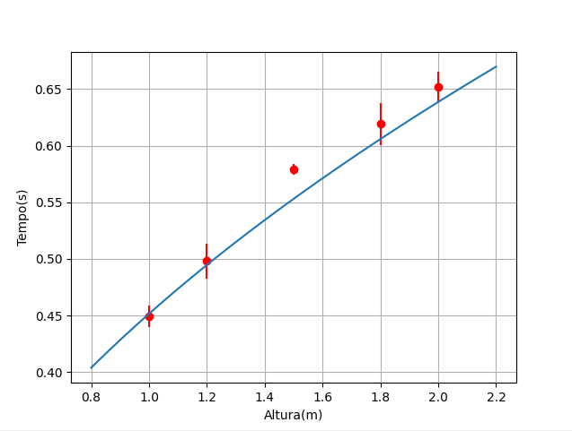

# AnaliseDeDados_Gravitação

#### Nesse projeto recolhemos os dados de tempo de queda, em segundos, de um objeto 5 vezes em 5 alturas diferentes e colocamos nos arquivos (altura[1 a 5].txt).

* No primeiro script (**trabalhoparcial.py**) lemos os arquivos de altura 1 a 5 e calculamos a media e o desvio padrão para os tempos de queda de cada altura e colocamos em um arquivo reduzido.
* No segundo script (**trabalhoparcial2.py**) lemos o arquivo reduzido e plotamos os tempos médios para cada altura e seus desvios padrões.Enfim, comparamos os resultados dos tempos medios com a reta traçada pela função gravitacional usando o valor teórico de G como 9.81m/s^2.

## Resultado:

